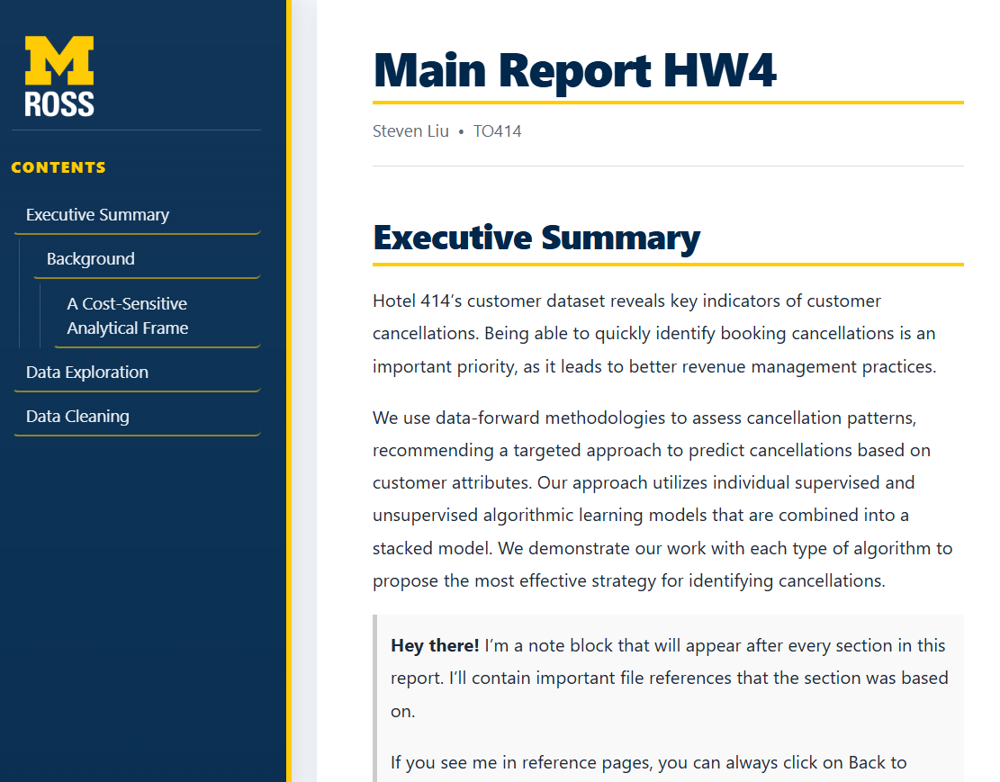

# Ross Custom CSS Rmarkdown



This is a custom Ross-branded CSS, perfect for business related data analytics assignments. It features the Ross logo as well, with a smooth user experience. 

## How to use

1. Download the files into your Rstudio project folder.
2. Edit your title, name, and date in ross-header.html
3. Create your YAML. This will go at the top of the RMD file.

```
---
output:
  html_document:
    css: ross-rmarkdown.css
    toc: true
    toc_float: false
    includes:
      before_body: ross-header.html
---
```

That's it! Hope you enjoy.

This was created for an assignment in Technology and Operations 414. 

(Disclaimer: I do not own the Ross logo)
